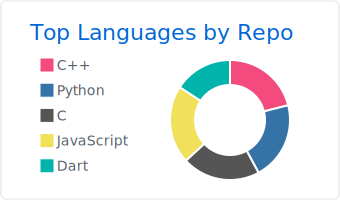
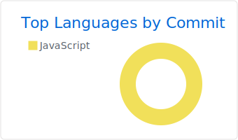
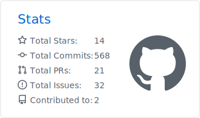

<h1 align="center">Hello everyone, I'm Kevenny 👋</h1>

<h3 align="center">I'm a Brazilian Information System student at Federal University of Sergipe </h3>

<h3 align="left">👨‍💻 Skills:</h3>

---

<!-- ICONS TO SKILLS -->
<p align="center">


</p>


---


```dart
class Developer {
  final String username;
  final String name;
  final String website;
  final String email;
  final List<String> social;
  final Map<String, dynamic> code;
  Developer()
      : username = 'KevennyJS',
        name = 'Kevenny J Santos',
        website = 'kevenny.studio',
        email = 'kevennykeke@gmail.com',
        social = [
          'https://www.linkedin.com/in/kevennyjs/',
          'https://medium.com/@kevennykeke/',
          'https://instagram.com/kevennyjs',
        ],
        code = {
          'mobile': ['Flutter'],
          'frontend': ['Flutter', 'VUE', 'HTML', 'CSS', 'JavaScript'],
          'backend': ['C/C++', 'C#', '.NET', 'NodeJS', 'NestJS', 'Go','Python','PHP', 'LUA', 'Haskell'],
          'low_level': ['Assembly'],
          'database': ['SQL SERVER', 'MySQL', 'PostegreSQL','Oracle', 'Mongo DB'],
          'devops': ['Docker', 'GitHub Actions'],
          'tools': [
            'GIT',
            'GitHub',
            'GitLab',
            'BitBucket',
            'Azure DevOps',
            'Prisma',
            'Elementor'
          ],
          'misc': ['Firebase', 'TDD', 'SCRUM', 'SOLID', 'Clean Archtecture', 'Figma']
        };
}
```
---
[](https://github.com/kevennyjs)

[](https://github.com/kevennyjs)

<!--


[](https://github.com/vn7n24fzkq/github-profile-summary-cards)
[](https://github.com/vn7n24fzkq/github-profile-summary-cards)
[](https://github.com/vn7n24fzkq/github-profile-summary-cards)
[](https://github.com/vn7n24fzkq/github-profile-summary-cards)

