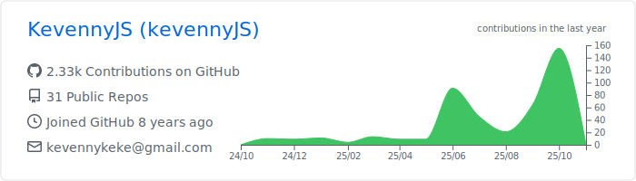

<h1 align="center">Hello everyone, I'm Kevenny 👋</h1>

<h3 align="center">I'm a Brazilian Information System student at Federal University of Sergipe </h3>

<h3 align="left">⚡ Experience in Work and Projects:  </h3>

---

- Currently internship developer to start-up ELESSON (a digital education system) using Flutter [Since 07/2020]
- Concluded Data Mining research project using Pyhton at university as a volunteer participant! [Started and finished in 2019]
- Monitor to project "preparatory course to OBI exam" at university as a volunteer participant! [Started in 2019(first class) ages until the present day (second class)]
- Currently freelancer to more 2 enterprises, but i can't name the names because of the confidentiality term. But, both using Flutter and API's.

<h3 align="left">👨‍💻 Skills:</h3>

---

<!-- ICONS TO SKILLS -->

<h3 align="left">📥 Contact:</h3>

---

<h3 align="left">📊 graphs:</h3>

---

<!--

**KevennyJS/KevennyJS** is a ✨ _special_ ✨ repository because its `README.md` (this file) appears on your GitHub profile.
https://www.linkedin.com/in/kevenny-de-jesus-santos/

Here are some ideas to get you started:

- 🔭 I’m currently working on ...
- 🌱 I’m currently learning ...
- 👯 I’m looking to collaborate on ...
- 🤔 I’m looking for help with ...
- 💬 Ask me about ...
- 📫 How to reach me: ...
- 😄 Pronouns: ...
- ⚡ Fun fact: ...
-->

